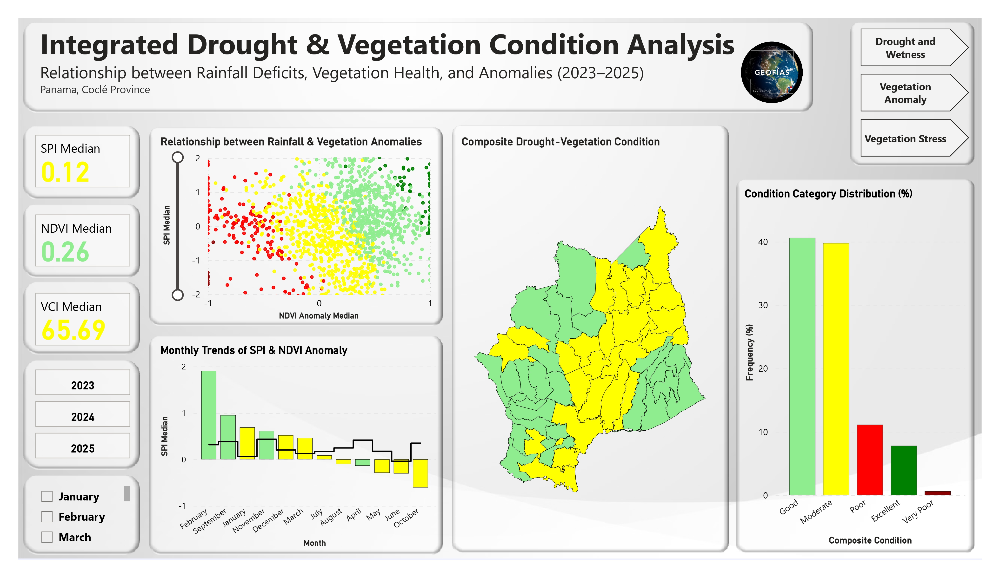
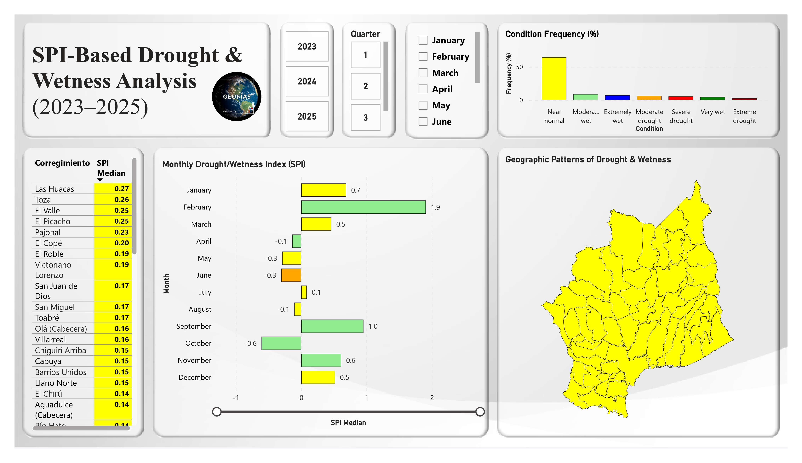
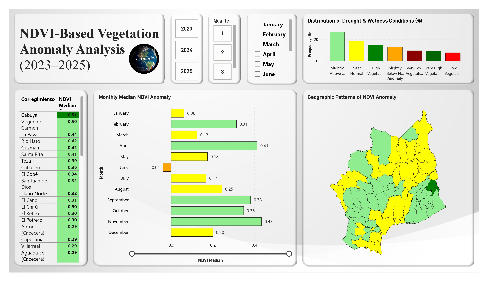
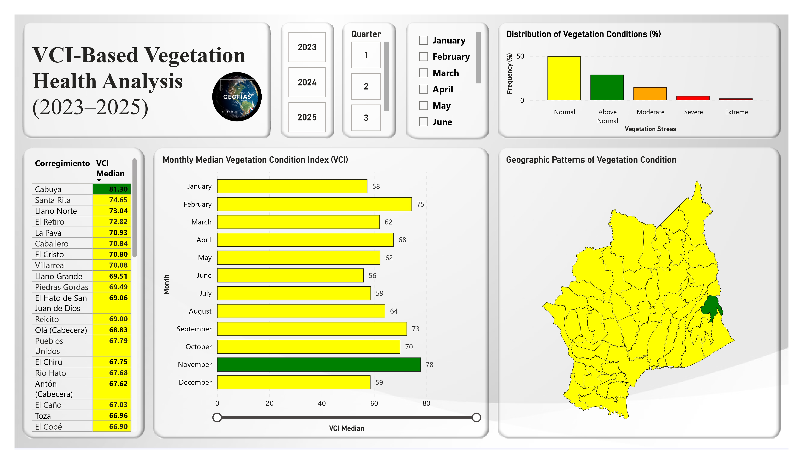
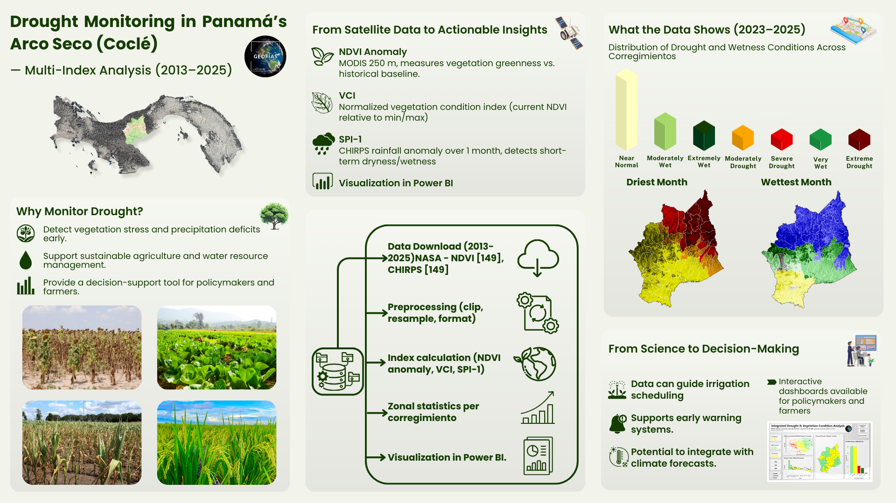

# Drought Monitoring in Panamá’s Arco Seco (Coclé) — Multi-Index Analysis (2013–2025)

[](#license)


**Objective.** Analyze drought dynamics in the Arco Seco region of Panama by integrating satellite-derived indicators — NDVI anomaly, Vegetation Condition Index (VCI), and Standardized Precipitation Index (SPI-1). Using zonal statistics at the corregimiento level, the project provides insights into vegetation stress, precipitation variability, and overall drought conditions, supporting better decision-making for agricultural and environmental management in Coclé Province.


---

## Overview

- **Study area:** Coclé Province (Panama)  
- **Period:**
  - **Historical Data:** 2013–2022 (used to calculate baselines and reference values)
  - **Dashboard Results:** 2023–2025 (SPI-1, NDVI Anomaly, and VCI visualizations based on the historical baseline)  
- **Spatial unit:** Corregimientos (53)  
- **Indicators:**
  - **NDVI anomaly:** Current NDVI vs historical baseline (2013–2022)
  - **VCI:** NDVI normalized to historical min–max (0–100)
  - **SPI-1:** 1-month Standardized Precipitation Index from CHIRPS

This repo includes **scripts**, **schema**, and **images** of the **Power BI** dashboards and **infographic**.

---

## Repository map

- `data/` — metadata, sample rasters, and demo `zonalstats` subset  
- `code/` — ArcGIS geoprocessing scripts, PostGIS SQL, and Power BI DAX notes  
- `reports/` — infographic, dashboard screenshots, Panama map highlighting Coclé  

---

## Method (condensed)

1. **Data ingestion**
   - MODIS NDVI (250 m); CHIRPS (~5 km resampled to 250 m).
2. **Preprocessing**
   - Reprojection, resampling (CHIRPS → 250 m), and clipping to AOI.
3. **Indices**
   - **NDVI anomaly:** z-score vs 2013–2022 baseline (σ>0.1 mask to ensure stability).
   - **VCI:** `(NDVI − NDVI_min)/(NDVI_max − NDVI_min) × 100`.
   - **SPI-1:** Fitted gamma → standardized (monthly).
4. **Zonal statistics**
   - Mean per corregimiento per month for NDVI anomaly, VCI, SPI-1.
5. **Database**
   - PostGIS table with **duplicated geometries per month** → time-enabled exports.
6. **BI**
   - Power BI model with measures:
     - **Color hex** and **labels** for SPI/NDVI/VCI
     - **Composite index** + label for the overview page
   - Pages: **Front page** integration, SPI, NDVI anomaly, and VCI.

<p align="center">
  
  
</p>
<p align="center">
  
  
</p>


---

## Data dictionary (zonalstats)

| Field          | Type    | Description                                |
|----------------|---------|--------------------------------------------|
| corregimie     | text    | Corregimiento name                         |
| fecha          | date    | Year-month (YYYY-MM-01)                    |
| spi_1          | float   | Standardized Precipitation Index (1-month) |
| ndvi_anom      | float   | NDVI anomaly (clamped to [−1, +1])         |
| vci            | float   | Vegetation Condition Index (0–100)         |

See `data/metadata/dictionary_zonalstats.csv` for full details.

---

## Key visuals

> All images are in `reports/images/`. Use alt text for accessibility.

- **Infographic (16:9):** `infographic_16x9.png`  
- **Front page (composite):** `dashboard_frontpage.png`  
- **SPI page:** `dashboard_spi_page.png`  
- **NDVI anomaly page:** `dashboard_ndvi_page.png`  
- **VCI page:** `dashboard_vci_page.png`  
- **Panama (Coclé highlighted):** `panama_cocle_highlight.png`



---

## How to cite

If you reference this repository:

```bibtex
@misc{tamir_arco_seco_2025,
  title   = {Drought Monitoring in Panama’s Arco Seco (Coclé) — Multi-Index Analysis (2013–2025)},
  author  = {Tamir, Chong},
  year    = {2025},
  url     = {https://github.com/geofias/arco-seco-drought-monitoring}
}
```
